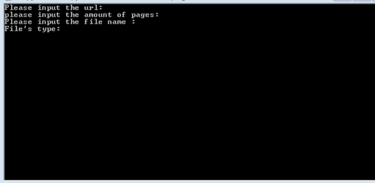

## Use guide:
A working but also rough wenku.baidu scraping python program,only supports 4 document types: txt, docx, pdf_txt, pdf_img. 

## All you need to do :

 input parameters of the document you want to scrape __correctly__,especially "File's type" must be correct,only can input within 4 types: txt, docx, pdf, pdf_img.("pdf_txt" stands for pdf text file, "pdf_img" for image combinated pdf )
 
 when website which you input opened on chrome automatically ,scroll through the whole document to let selenium catch the whole html data.

## material:
Chrome
## python library
from selenium import webdriver

from bs4 import BeautifulSoup as BS

from selenium import webdriver

import time

from docx import Document

from docx.shared import Inches, Pt

from docx.enum.text import WD_PARAGRAPH_ALIGNMENT

import requests

import os

from PIL import Image

___
__WARNING: Can not be used for commercial and piracy.__
